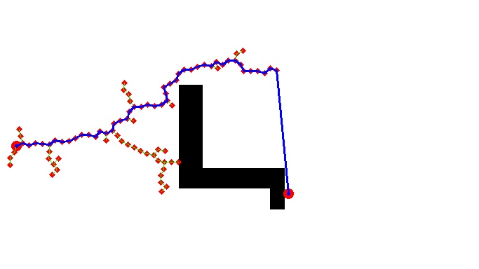
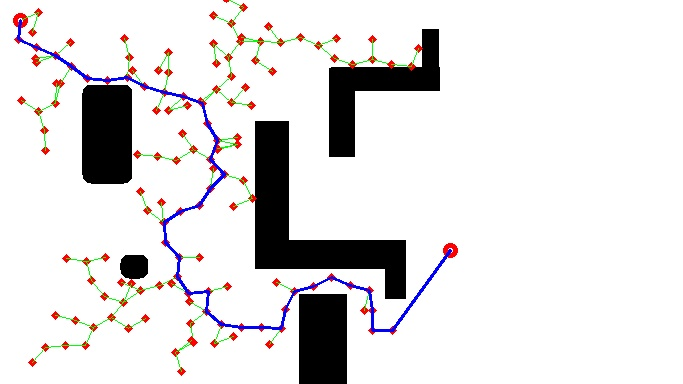
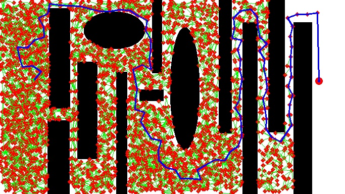

# RRT

For more info visit the [blog](https://nimrobotics.github.io/2019/12/23/rrt.html)

**Author(s):** Aakash Yadav

# Usage 

See the various CLI options using `python3 rrt.py -h`

Example `python3 rrt.py -selectPoint -p world4.png -s 20`. The flag `-selectPoint` allows to select the start and end points by double clicking, after selecting the two points press <kbd>ESC</kbd>.

# Sample outputs

# License 

MIT